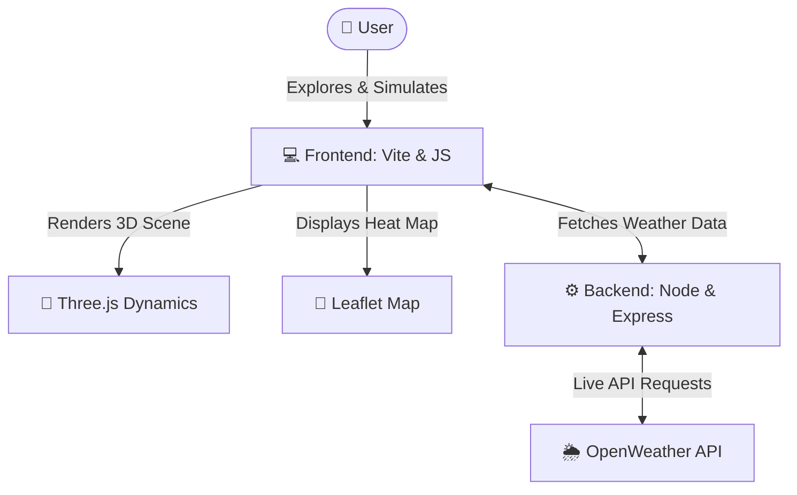

<h1 align="center">Vayucool</h1>

<p align="center">
  <em>The Interactive Urban Thermal Experience</em>
</p>

<p align="center">
  
  
  
</p>

---

## 🏢 Overview
**Vayucool** is a cutting-edge, interactive web application designed to visualize and simulate the **Urban Heat Island (UHI)** effect. Using advanced thermodynamics and real-city data, Vayucool allows urban planners, researchers, and citizens to understand how building density, greenery, and airflow impact city temperatures.

Our mission is to turn complex science into an intuitive, cinematic experience that inspires cooler, more sustainable urban design.

---

## 🚀 Key Features

### 1. 🌡️ Interactive Thermodynamics Simulation
Explore the three primary modes of heat transfer in cities:
- **Radiation**: See how sunlight is absorbed by concrete and asphalt.
- **Conduction**: Visualize heat storage and transfer through solid urban materials.
- **Convection**: Observe how restricted airflow traps heat in dense city grids.

### 2. 🗺️ Real-Time Map Visualization
Integrated with **Leaflet.js**, our map dashboard provides a 24-hour heat profile, comparing urban temperatures with surrounding rural areas in real-time.

### 3. 🏙️ Urban Planning Simulator
Tweak city parameters and watch the temperature drop:
- **Greenery Coverage**: Add parks and vertical forests.
- **Building Density**: Adjust the gap between structures.
- **Surface Reflectivity**: Implement cool roofs and reflective materials.
- **Wind Corridors**: Optimize airflow to dissipate heat.

### 4. 📊 Data-Driven Insights
Dynamic 24-hour charts (powered by **Chart.js**) show the "Heat Gap" between cities and nature, helping users identify peak thermal stress hours.

---

## 🛠️ Tech Stack

| Layer | Technology |
| :--- | :--- |
| **🌐 Frontend** | Vite, Vanilla JavaScript |
| **🧊 3D Rendering** | Three.js |
| **🎬 Animations** | GSAP (GreenSock) |
| **🗺️ Maps** | Leaflet.js |
| **📊 Data Viz** | Chart.js |
| **⚙️ Backend** | Node.js, Express |
| **🎨 Styling** | Custom CSS3 (PostCSS) |

---

## 🏗️ Project Architecture


---

## 🛠️ Installation & Setup

### Prerequisites
- Node.js (v18+)
- npm

### 1. Clone the Repository
```bash
git clone https://github.com/anureddyb20/Vayucool.git
```

### 2. Install Dependencies
```bash
npm run install:all
```

### 3. Run Development Server
```bash
npm run dev
```
The application will be available at:
- **Frontend**: `http://localhost:5173`
- **Backend API**: `http://localhost:3001`

---

## 🎯 Manual Usage

If you'd like to run the demo and explore the features:

1. **Environment Setup**: Copy `.env` details from `server/.env.example` to `server/.env`.
2. **Launch Hub**: Run `npm run dev` to start both the Frontend and Backend services concurrently.
3. **Explore the Platform**:
    - **Interactive Story**: `http://localhost:5173`
    - **Urban Simulator**: `http://localhost:5173/simulator.html`

---

## 🌍 Impact
Urban Heat Islands affect over **1 billion people** globally, increasing energy consumption and health risks. **Vayucool** aims to reduce this intensity by up to **7°C** through informed urban planning and public awareness.

---

<p align="center">
  Developed with passion for a Cooler & Sustainable Future by <b>Team Elites</b>
</p>
